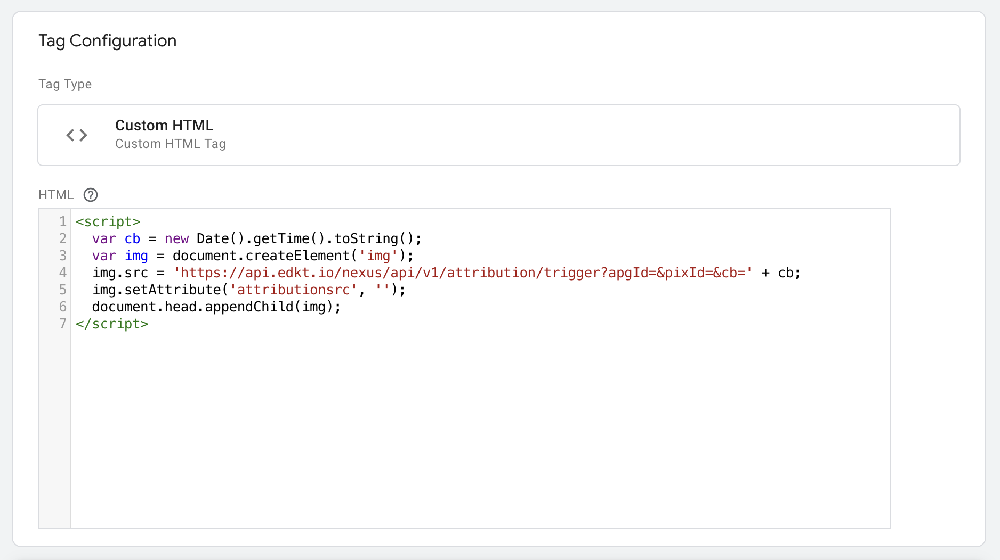

# PSB - Setup

The setup is a three step process:

1. Create an attribution pixel group in the
   [AirGrid platform](https://app.airgrid.io).
2. Add a pixel to the display creative.
3. Add a pixel to your landing and conversion pages.

For the beta steps 1 & 2 can be handled by the team at MiQ/AirGrid. The webpage
pixels will need to be added by the advertiser, this guide assumes the use of
[Google Tag Manager](https://tagmanager.google.com/) but any similar tag
management solution can be used or even direct hardcoding onto the webpage.

## Creative Pixel

The creative pixel is unique to each campaign & advertiser, these are created as
an attribution pixel group (APG) in the AirGrid platform. This group links
together pixels which must be added to the creative and those which need to be
added to the conversion point on the advertiser's website.

The creative pixel is an image tag with a special attribute, such as the
following:

```html
<!-- NOTE: Replace the src here with the unique creative pixel from the platform. -->

```

The `attributionsrc` HTML attribute is vital for the pixel to register source
events (impressions). This means that the pixel cannot be added as an image URL,
where there is no option to set custom attributes and should be added as a HTML
tag (above) or a raw JS snippet:

```js
// NOTE: Replace the src here with the unique creative pixel from the platform.
var img = document.createElement("img");
img.src =
  "https://api.edkt.io/nexus/api/v1/attribution/source?apgId=[PIXEL GROUP ID]&adDom=${ADSXT_AD_SYSTEM_DOMAIN}&adPubId=...";
img.setAttribute("attributionsrc", "");
document.head.appendChild(img);
```

::: warning Generate unique tags in AirGrid

The tags/code in this guide serves as an example only, please make sure you use
the unique versions generated by the AirGrid platform.

:::

Guides for popular DSPs will be added soon!

## Google Tag Manager

To complete the conversion tracking integration via GTM, you will need to:

1. Create a **Custom HTML Tag**.
2. Create a **Trigger**.

::: info Traditional measurement

To keep the test vs your traditional cookie & ID based measurement, the below
setup should duplicate that process, i.e please fire the new sandbox pixels in
the same locations.

:::

### Create a Custom HTML Tag

[Official GTM docs](https://support.google.com/tagmanager/answer/6107167)

Custom HTML tags allow the addition of the privacy sandbox pixel to your
webpages. We require you to use a custom HTML tag and **not an image tag**, due
to the fact there is a special directive present in the HTML `attributionsrc`
which is responsible for telling the browser this is a special pixel which
should be used for attribution measurement via the Privacy Sandbox APIs.

Please follow the official GTM docs linked above to create a custom HTML tag for
each attribution pixel you have either created in the AirGrid platform, or have
been sent by your account manager.

The code which you insert into the box labelled `HTML`, should look like the
following:

```html
<script>
  var cb = new Date().getTime().toString();
  var img = document.createElement("img");
  img.src =
    "https://api.edkt.io/nexus/api/v1/attribution/trigger?apgId=[PIXEL GROUP ID]&pixId=[PIXEL ID]&cb=" +
    cb;
  img.setAttribute("attributionsrc", "");
  document.head.appendChild(img);
</script>
```

This code performs the following actions:

1. Creates a cachebuster by creating a timestamp and converting to a string.
2. Creates an `img` DOM object.
3. Attach the `src` destination to the `img`.
4. Attach the special HTML attribute `attributionsrc` which makes the browser
   aware this is a privacy sandbox pixel.
5. Append the newly created `img` tag to the head of the HTML document
   (webpage).

A screenshot of the final setup:



### Create a Trigger

[Official GTM docs](https://support.google.com/tagmanager/answer/7679316)

Create two triggers one per custom HTML tag created in the previous step. You
will need to add a filter per tag. Each filter is made up of a `Variable`, an
`Operator` and a `Value`. An example setup will look like:

- `Page URL does not contain /checkout/`: for the site wide pixel.
- `Page URL contains /checkout/`: for the conversion pixel.

Assign the correct tag to be fired for the two newly created triggers and we are
done! Time for a beer 🍺.
