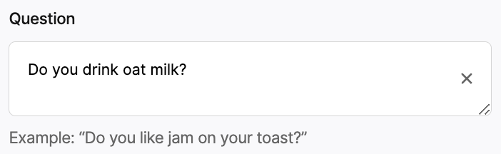

# Synthetic Panel

## Introduction

Panel data has been used in marketing activities for many years. Brands &
marketers use human panel participants for feedback on new products, marketing
campaigns and many more topics to help gain a competitive egde in the market.

This `lab` introduces the concept of a synthetic panel, this is a panel powered
by AI participants. Each participant has been conditioned on a life story to
ensure they represent a sub-section of the population. Since this panel is
synthetic, it has some distinct advantages:

- Ask any question at any time
- Can be updated with to the minute knowledge of world events
- Extremely cheap to run as compared to human participants

We are not in anyway suggesting that a AI (LLM) powered synthetic panel can
remove the need for human panel, rather we see this as a potential new tool for
the marketer ever expanding toolbox.

## Usage

Begin with a question, this can be anything! Here are some ideas:

- What is your favourite jam flavour?
- Who will you vote for in the US elections in 2024?

Next add some options for the panel to choose from:

- Raspberry, Apricot, Marmalade
- Democrats, Republicans

Finally you can optionally:

- Condition the responses on a statement.
- Split by a demographic (gender, generation).
- Specify a geography (US, UK).

Hit run, and you will receive your replies in a matter of seconds. Now grab a
coffee and admire your excellent market research work ☕ !

